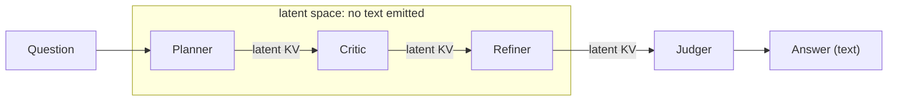
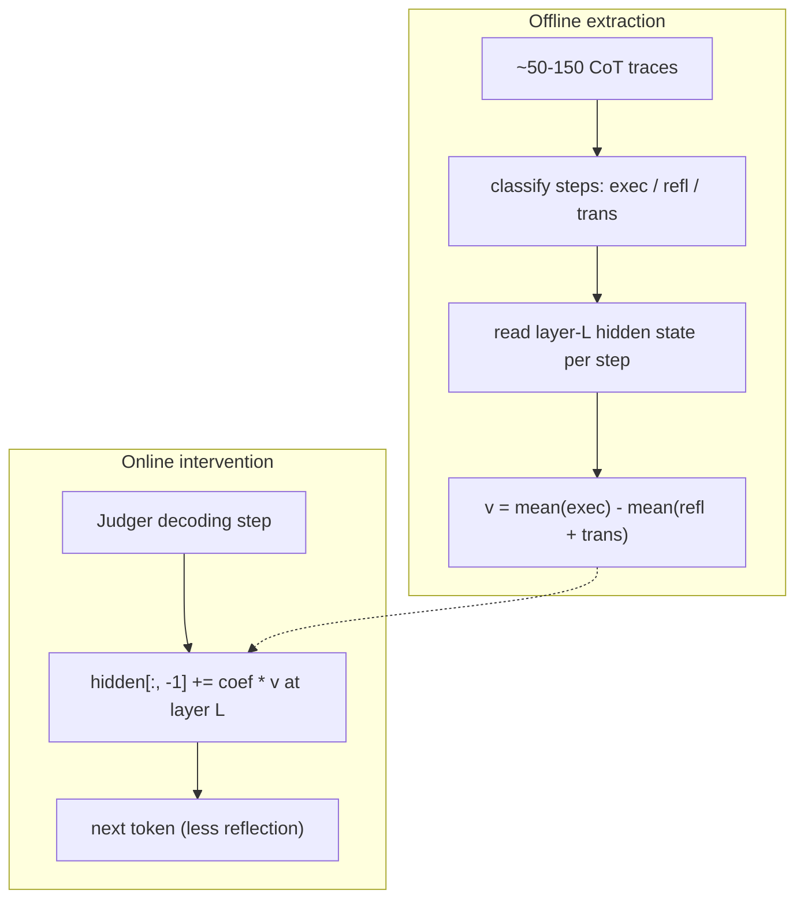
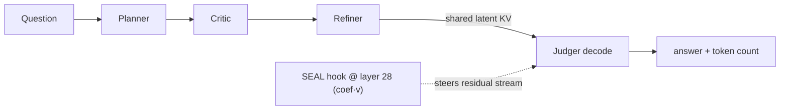
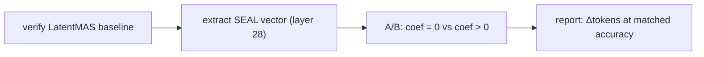

# Experiment Overview: SEAL-steered LatentMAS for Token Efficiency

> Audience: you know LLM mechanics (transformers, attention, the KV cache,
> hidden/residual streams, autoregressive decoding, activation steering) but have
> never seen this repo, **LatentMAS**, or **SEAL**. This doc explains the whole
> setup end-to-end so you can follow (and reproduce) the experiment.

---

## 1. One-paragraph summary

We take **LatentMAS** — a training-free multi-agent framework where LLM agents
collaborate by passing **latent state (KV cache)** instead of text — and bolt on
**SEAL** — a training-free **steering vector** that suppresses redundant
"reflection/transition" reasoning. Our goal is **token efficiency**: make the one
agent that actually writes text (the *Judger*) reason more concisely (fewer output
tokens) **without losing accuracy**. We first reproduced LatentMAS's published
accuracy on Qwen3-14B (a faithfulness check), then added SEAL steering to the
Judger's decoding and measure the change in output tokens vs. accuracy.

---

## 2. Background A — LatentMAS (the base system)

Paper: *Latent Collaboration in Multi-Agent Systems* (Zou et al., arXiv:2511.20639).

### 2.1 The idea
A normal text multi-agent system (TextMAS) has agents talk to each other in
natural language: agent A decodes tokens → agent B re-encodes those tokens. That
round trip is lossy (rich hidden states collapse to discrete tokens) and
expensive (you pay full autoregressive decoding for every inter-agent message).

LatentMAS keeps the collaboration **inside the model's latent space**:

1. **Latent thought generation.** Instead of decoding a token, an agent takes its
   **last-layer hidden state** `h_t` and feeds it back in as the *next input
   embedding*, repeating for `m` "latent steps". No softmax, no detokenize/retokenize
   — the agent "thinks" purely as a sequence of hidden vectors.
2. **Input-output alignment.** A raw last-layer hidden state is not distributed
   like an input embedding, so feeding it back can cause out-of-distribution
   activations. LatentMAS multiplies it by a small realignment matrix
   `W_a ≈ W_out^† W_in` (pseudo-inverse of the unembedding times the embedding),
   computed once per run, to map "output space" back to "input space". (In this
   repo `W_a` is only applied when `--latent_space_realign` is set; otherwise the
   identity is used with a norm-matching rescale.)
3. **Latent working-memory transfer.** After an agent finishes its `m` latent
   steps, its **entire layer-wise KV cache** (`past_key_values`) is handed to the
   next agent, who *prepends* it to its own cache. The inter-agent "message" is
   literally the **keys and values** — both the original context and the new
   latent thoughts — so the transfer is lossless and needs no re-encoding.

Only the **final agent decodes text**. Everyone before it just grows the shared
KV cache.

### 2.2 Agent topologies
- **Sequential (used here):** a chain of four role agents — **Planner → Critic →
  Refiner → Judger** (see `methods/__init__.py`). Each non-Judger runs latent
  steps and passes KV forward; the Judger decodes the final `\boxed{...}` answer.
- **Hierarchical:** domain-expert agents in parallel feeding a summarizer. (Not
  used in our current experiment.)



### 2.3 Why it wins
Fewer decode steps (latent steps `m` ≈ 40 replace thousands of decoded tokens) →
lower token usage and faster inference, while the KV transfer preserves more
information than text. The paper reports up to +14.6% accuracy, 70-84% fewer
output tokens, and 4x+ speedups vs. TextMAS.

---

## 3. Background B — SEAL (the intervention)

Paper: *SEAL: Steerable Reasoning Calibration of LLMs for Free* (Chen et al.,
arXiv:2504.07986).

### 3.1 The idea
Long chain-of-thought traces contain a lot of **redundant** reasoning. SEAL
categorizes reasoning steps into three thought types:

- **execution** — carrying the solution forward (computations, deductions).
- **reflection** — re-checking / doubting / verifying ("wait", "let me check"...).
- **transition** — switching strategy / restarting ("alternatively", "instead"...).

Excessive reflection + transition correlates with over-thinking (and with
*failures*). Critically, these thought types are **linearly separable in the
latent space of deep layers**. So SEAL:

1. **Offline:** from ~100 reasoning traces, collect the deep-layer hidden state at
   each step, label the step, and build a **steering vector**
   `v = mean(execution) - mean(reflection ∪ transition)`.
   (Our sign convention: `+v` points *toward* execution / *away from* reflection.)
2. **Online:** during decoding, add `coef * v` to the residual stream at that deep
   layer. With `coef > 0` this nudges the model away from spawning
   reflection/transition thoughts → shorter, more direct reasoning.

It is training-free, single-layer, and adds negligible latency.



---

## 4. What WE built — SEAL on the LatentMAS Judger

### 4.1 The key insight
In LatentMAS, **only the Judger emits text**. The Planner/Critic/Refiner reason in
latent space and emit zero tokens. Therefore, if the objective is **token
efficiency**, the place to intervene is the **Judger's text decoding** — that's
where every output token is spent and where over-reasoning shows up.

(An earlier internal pilot applied SEAL to the *latent* agents only and saw no
effect on accuracy — and, by construction, it could not reduce text tokens because
those agents emit none. We deliberately target the Judger instead.)

### 4.2 Mechanism
- We register a `forward_hook` on decoder layer **L = 28** (of Qwen3-14B's 40
  layers; deep layers are where thought types separate).
- During `generate_text_batch` (the Judger's decode loop) the hook adds
  `coef * unit(v)` to the residual stream at the **current token position** each
  step. Outside Judger decoding the hook is inert.
- We sweep `coef` (it controls intervention strength). `coef = 0` reproduces plain
  LatentMAS; `coef > 0` suppresses reflection/transition.

### 4.3 Measuring the thing we care about
The stock repo only reported accuracy + wall time. We added **output-token
counting**: in `generate_text_batch` we count generated tokens up to the first EOS
(ignoring padding) per sample, thread it through the methods, and report
`total_output_tokens` / `mean_output_tokens` in the result JSON. The A/B metric is:

> **Δ tokens** (does SEAL shorten the Judger's output?) at **matched accuracy**.



---

## 5. Code map (what lives where)

| Path | Role |
|---|---|
| `run.py` | CLI entry: pick method/model/task, run eval, print result JSON (now incl. token metrics + `--seal*` flags). |
| `models.py` | `ModelWrapper`: HF (and vLLM) loading, latent realignment `W_a`, `generate_latent_batch` (latent steps), `generate_text_batch` (Judger decode + **SEAL hook** + **token counting**). |
| `methods/latent_mas.py` | LatentMAS pipeline: loop over Planner/Critic/Refiner (latent) then Judger (text); KV transfer; records `output_tokens`. |
| `methods/baseline.py` | Single-agent baseline (also reports `output_tokens`). |
| `methods/text_mas.py` | Text multi-agent baseline. |
| `prompts.py`, `data.py`, `utils.py` | Prompt construction, dataset loaders, answer parsing. |
| `seal/thought_classifier.py` | Heuristic exec/reflection/transition labeler. |
| `seal/vector_generation.py` | `v = mean(exec) - mean(refl+trans)` (+ unit-norm). |
| `seal/extraction.py` | Offline: generate CoT, classify steps, read layer-L hidden states, build `v`. |
| `seal/hooks.py` | `SealSteerer`: registers/removes the residual-stream forward hook. |
| `scripts/extract_seal_vector.py` | CLI to produce + save the steering-vector artifact. |

---

## 6. Experimental setup

| Item | Value |
|---|---|
| Backbone | `Qwen/Qwen3-14B` (40 layers, hidden dim 5120) |
| Backend | HuggingFace Transformers (single-GPU per run); vLLM available but not used for these A/Bs |
| Hardware | RunPod pod, 2x NVIDIA H200 (143 GB each) |
| Software | torch 2.8.0+cu128, transformers 4.57.1, vllm 0.11.0, CUDA 12.8, Python 3.12 |
| MAS setting | Sequential (Planner -> Critic -> Refiner -> Judger) |
| Latent steps | 40 per non-Judger agent |
| Sampling | temperature 0.6, top-p 0.95, seed 42 |
| Tasks | GSM8K (math), ARC-Challenge (commonsense), MedQA (medical QA) |
| SEAL layer | 28 |
| SEAL vector | `v = mean(exec) - mean(refl+trans)` from ~50 GSM8K-train CoT traces |
| Metrics | accuracy (answer correctness), `mean_output_tokens` (Judger output length) |

### 6.1 Pipeline
1. **Verify baseline** (done): run plain LatentMAS, confirm accuracy matches the
   paper on Qwen3-14B (faithfulness of our fork).
2. **Extract steering vector** (`scripts/extract_seal_vector.py`): generate CoT on
   GSM8K-train, classify steps, build `v` at layer 28, save artifact.
3. **A/B evaluate:** run LatentMAS with `--seal_coef 0` (control) and several
   `coef > 0` values on GSM8K (n≈100-150); compare accuracy and `mean_output_tokens`.



---

## 7. Results so far

### 7.1 Baseline faithfulness (our fork vs. paper, Qwen3-14B, n=150)
| Task | Our LatentMAS | Paper LatentMAS |
|---|---|---|
| GSM8K | 92.7% | 95.2% |
| ARC-Challenge | 94.7% | 95.6% |
| MedQA | 79.3% | 80.7% |

All within ~1-2.5 points (subset, single seed, stochastic decoding vs. the paper's
3-seed full-set means) — the fork reproduces LatentMAS faithfully.

### 7.2 SEAL token-efficiency A/B
_Pending the current GPU run; this section will hold the coef sweep:
accuracy vs. `mean_output_tokens` for `coef ∈ {0, ...}`._

---

## 8. How to reproduce

```bash
# 0. env (one-time): venv reusing system torch + vllm + transformers 4.57
#    HF_HOME pointed at a large volume; Qwen3-14B cached.

# 1. extract the steering vector (layer 28, GSM8K-train)
python scripts/extract_seal_vector.py \
  --model_name Qwen/Qwen3-14B --task gsm8k --split train \
  --layer_index 28 --max_traces 50 --max_new_tokens 768 \
  --out artifacts/seal_vectors/qwen3-14b/gsm8k_layer28.pt

# 2a. control (plain LatentMAS) — reports mean_output_tokens
python run.py --method latent_mas --model_name Qwen/Qwen3-14B --task gsm8k \
  --prompt sequential --latent_steps 40 --max_new_tokens 2048 \
  --max_samples 150 --generate_bs 25 --temperature 0.6 --top_p 0.95

# 2b. SEAL-steered Judger (sweep --seal_coef)
python run.py --method latent_mas --model_name Qwen/Qwen3-14B --task gsm8k \
  --prompt sequential --latent_steps 40 --max_new_tokens 2048 \
  --max_samples 150 --generate_bs 25 --temperature 0.6 --top_p 0.95 \
  --seal --seal_vector artifacts/seal_vectors/qwen3-14b/gsm8k_layer28.pt \
  --seal_coef 8
```

---

## 9. Limitations & open questions

- **Coefficient calibration.** The right `coef` is unknown a priori (it scales a
  unit vector against deep-layer residual norms); we sweep it. Too large → garbled
  output (could *increase* tokens or hurt accuracy).
- **Heuristic classifier.** Thought typing is keyword-based, not a learned probe;
  it is averaged over hundreds of steps, so noise mostly washes out, but it is
  approximate.
- **Cross-domain vector.** The vector is read from *text* CoT activations and
  applied during the Judger's *text* decoding (same modality) — but the Judger is
  also conditioned on transferred *latent* KV, so behavior may differ from a
  vanilla single-model decode.
- **Single layer / task.** Layer 28 and a GSM8K-derived vector; SEAL claims strong
  cross-task transfer, which we can test on ARC-C / MedQA.
- **Sampling noise.** temperature 0.6 adds variance to token counts; we use n≈100-150
  and a fixed seed to keep the A/B comparable.
