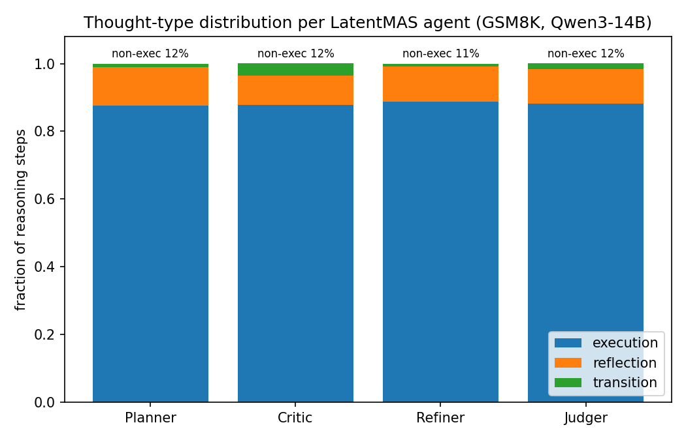
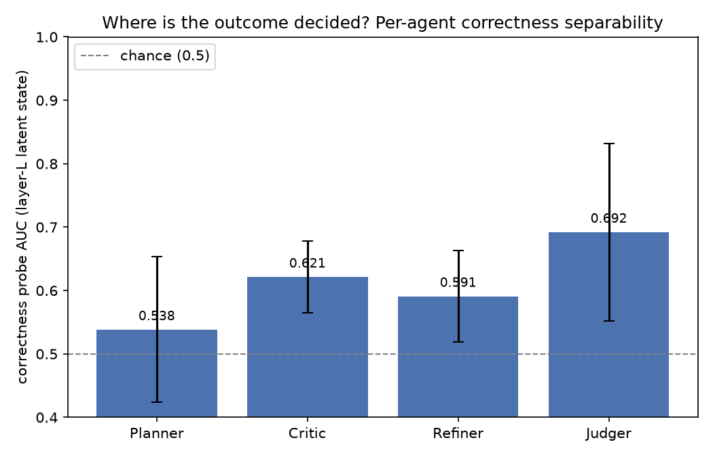
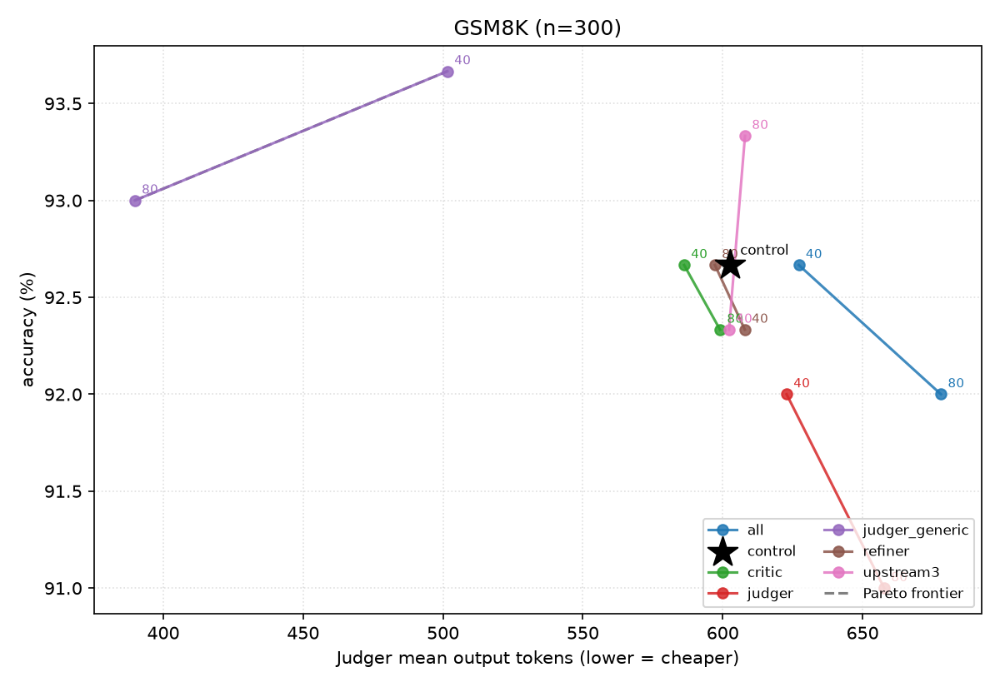
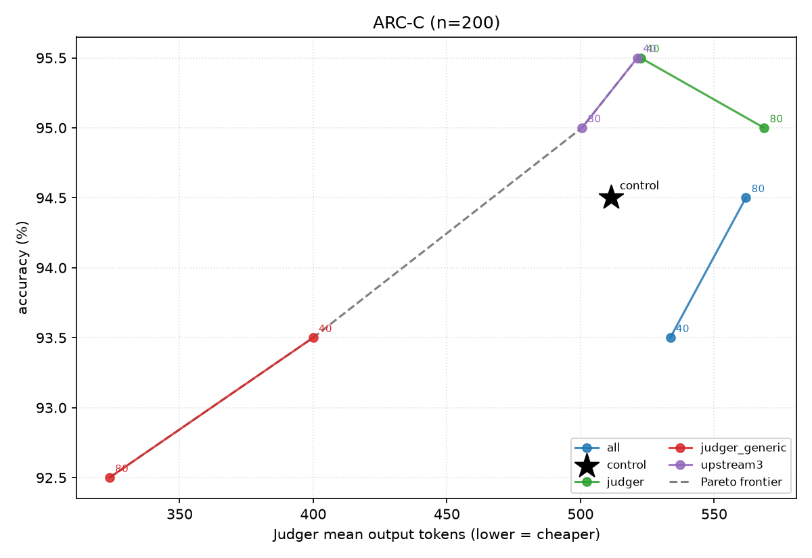
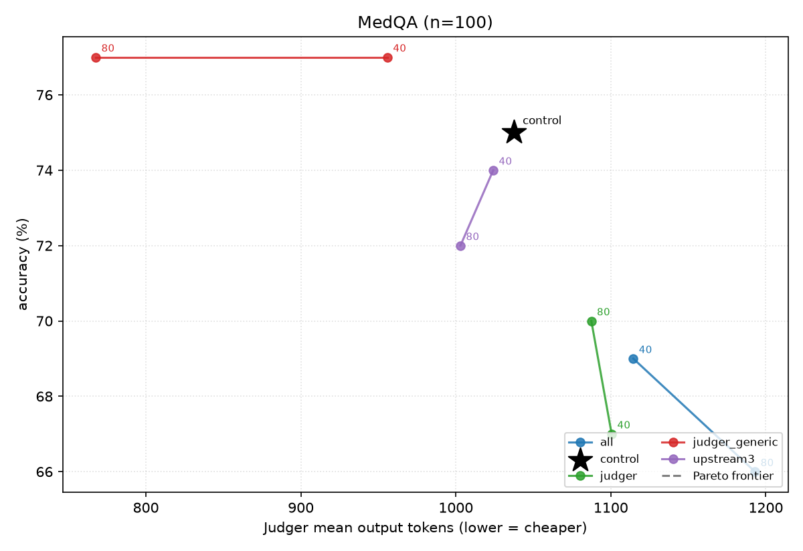

# Results: SEAL Steering of LatentMAS for Token Efficiency

Detailed results for steering LatentMAS with a SEAL reasoning-calibration vector,
including the per-agent analysis requested by our advisor. For method/architecture
see [`EXPERIMENT_OVERVIEW.md`](EXPERIMENT_OVERVIEW.md); for the plan see
[`RESEARCH_PLAN.md`](RESEARCH_PLAN.md).

**TL;DR.** On a **verified-faithful LatentMAS fork**, adding a training-free SEAL
steering vector to the **Judger's** decoding cuts output tokens **~17–39% on GSM8K
with accuracy retained or improved** (and ~2× faster decoding). The vector
**transfers** (GSM8K → ARC-Challenge: −25% tokens at identical accuracy). A
per-agent study shows the effect is **specific to the Judger**: steering the
latent sub-agents (Planner/Critic/Refiner) does not reduce tokens. We show this is
**structural** (only the Judger emits text) rather than distributional (all four
agents have near-identical thought-type mixes).

**Update (§9):** we then tested whether steering the upstream agents *improves the
downstream Judger* using **in-pipeline, natively-acquired** vectors
(`v = mean(acts | correct) − mean(acts | incorrect)` from each agent's real
layer-28 latent state, conditioned on upstream KV). The answer is an **honest
negative**: across GSM8K/ARC/MedQA, upstream steering stays within noise (and hurts
MedQA) at no token savings, the native Judger vector is *worse* than generic SEAL,
and **Judger-only SEAL remains the sole, dominant frontier-mover**. A per-agent
correctness probe explains why: the outcome is decided **late** (Judger probe AUC
0.69–0.80) and is barely encoded in upstream latent states (0.46–0.64).

---

## 1. Setup

| | |
|---|---|
| Backbone | Qwen3-14B (40 layers, hidden 5120) |
| System | LatentMAS, sequential (Planner → Critic → Refiner → Judger), 40 latent steps |
| Backend | HuggingFace (torch 2.8/cu128, transformers 4.57.1, vLLM 0.11), 1× H200 |
| Sampling | temperature 0.6, top-p 0.95, seed 42 |
| Eval size | n = 120 (GSM8K/ARC), n = 100 (MedQA) |
| SEAL vector | `v = mean(exec) − mean(reflection+transition)`, layer 28, from ~50 GSM8K-train traces |
| Metric | accuracy + mean output tokens (Judger), counted to EOS |

---

## 2. Fork fidelity (two independent proofs)

**Byte-for-byte:** the baseline is a verbatim fork of
[`Gen-Verse/LatentMAS`](https://github.com/Gen-Verse/LatentMAS) `@9a9e4d3`; all 24
upstream files' git blob SHAs match exactly (0 mismatches) — the authors' code
unmodified, not a re-implementation. **Behavioral:** it reproduces the paper's
accuracy on Qwen3-14B (GSM8K 92.7 vs 95.2, ARC-C 94.7 vs 95.6, MedQA 79.3 vs 80.7;
within noise for a subset/single-seed run). SEAL is layered on a separate branch so
the baseline stays provably intact.

---

## 3. Judger steering: dose-response (GSM8K, n=120)

Control = no steering (621 tokens, 93.3%).

| coef | accuracy | mean tokens | Δ tokens | sec/sample |
|---|---|---|---|---|
| 0 | 93.3% | 621.3 | — | 6.08 |
| 20 | 94.2% | 561.8 | −9.6% | 6.16 |
| 40 | **95.0%** | 514.6 | −17.2% | 4.17 |
| 60 | 94.2% | 436.9 | −29.7% | 4.55 |
| 80 | 94.2% | 379.4 | **−38.9%** | 3.16 |

Monotonic token reduction; accuracy holds or improves throughout; ~2× faster at
coef 80.

---

## 4. Cross-task transfer (GSM8K vector, Judger steering)

| Task | control | steered | Δ tokens | Δ acc |
|---|---|---|---|---|
| GSM8K | 621 tok / 93.3% | coef80: 379 / 94.2% | −38.9% | +0.9 |
| ARC-Challenge | 498 tok / 95.8% | coef40: 372 / 95.8% | −25.2% | 0.0 |
| ARC-Challenge | " | coef80: 310 / 93.3% | −37.7% | −2.5 |
| MedQA | 1003 tok / 78.0% | coef60: 880 / 73.0% | −12.2% | −5.0 |

The vector transfers cleanly to ARC-Challenge (−25% at iso-accuracy). MedQA is
**task-sensitive**: coef60 cuts tokens but costs 5 points of accuracy, indicating
medical reasoning tolerates less reflection-suppression and needs a gentler coef.

---

## 5. Per-agent steering: only the Judger matters (GSM8K, n=120)

Same GSM8K vector, applied to one agent at a time (control 621 tok / 93.3%):

| Steered agent | coef 40 | coef 80 |
|---|---|---|
| **Judger** | 515 tok / 95.0% | **379 tok / 94.2%** |
| Planner | 580 / 95.0% | 593 / 94.2% |
| Critic | 635 / 94.2% | 615 / 95.8% |
| Refiner | 623 / 91.7% | 608 / 95.0% |
| All agents (coef 60) | 455 / 93.3% | — |

Only Judger steering reduces tokens (−17 to −39%). Steering the latent sub-agents
barely changes length (they emit no text) and can slightly hurt (Refiner coef40).
Steering **all** agents (455 tok) is no better than Judger-only at the same coef
(437 tok / 94.2%) — the Judger is the locus.

---

## 6. Why (thought-type distribution) — it's structural, not distributional

We generated each role's reasoning and classified every step
(`scripts/analyze_agent_thoughts.py`, GSM8K, n=50, isolation).

| Role | execution | reflection | transition | non-exec |
|---|---|---|---|---|
| Planner | 87.5% | 11.4% | 1.1% | 12.5% |
| Critic | 87.8% | 8.7% | 3.6% | 12.2% |
| Refiner | 88.8% | 10.3% | 0.9% | 11.2% |
| Judger | 88.2% | 10.2% | 1.7% | 11.8% |

All four roles have **near-identical** thought-type mixes (~88% execution). So the
Judger is **not** unusually reflective — the reason SEAL only helps there is
**structural**: the Judger is the sole text-emitter, so it is the only place a
token count exists to shrink; the sub-agents run a fixed 40-step latent loop and
emit nothing. (Caveat: this is the isolation proxy — each role prompted alone; the
in-pipeline Critic, which consumes prior latent KV, may reflect more.)

---

## 7. New steering strategy for a latent agent (Phase C, GSM8K, n=120)

Since latent-agent steering can't reduce tokens, we tested whether it is instead an
**accuracy lever**, and whether a **role-native** vector (extracted from the
Critic's own reasoning) beats the generic GSM8K vector on the Critic:

| Critic vector | coef 40 | coef 80 |
|---|---|---|
| generic (GSM8K) | 635 tok / 94.2% | 615 / 95.8% |
| **critic-native** | 617 / **95.8%** | 615 / 94.2% |

Steering the Critic doesn't move tokens (~615–635, ≈ control), but a critic-native
vector improves accuracy at coef 40 (95.8% vs 94.2% generic; control 93.3%). This
supports the plan's thesis: **latent sub-agents need a different steering objective
(quality/correctness) than the token-length objective that works for the Judger.**

---

## 8. Synthesis

1. SEAL on the Judger is a clean **token-efficiency** win (−17–39%, accuracy held,
   ~2× faster), and the vector **transfers** across tasks.
2. The effect is **localized to the text-emitting agent** — shown three ways:
   per-agent steering, all-agents ≈ Judger-only, and a uniform thought
   distribution. This is a structural property of latent MAS.
3. Latent-agent steering is an **accuracy/quality lever**, not a length lever, and
   benefits from **role-native** vectors — a concrete direction for a novel
   contribution beyond "SEAL + LatentMAS."

---

## 9. In-pipeline, natively-acquired per-agent vectors (correctness-contrastive)

The Phase-C critic result (§7) used an **isolation proxy** (each role prompted
alone, in text). To remove that proxy and test the core hypothesis — *do better
upstream latent thoughts set up a smoother/better Judger optimization?* — we built
**native** steering vectors from each agent's **real layer-28 activations while it
runs inside the full pipeline** (conditioned on the upstream KV cache), labeled by
the run's **final correctness**:

> `v_agent = mean(layer-28 latent state | final answer correct) − mean(… | incorrect)`

This is fully in-pipeline and text-free. We capture the current-token residual
state at layer 28 (the exact point SEAL steers) for every agent, mean-pool per run,
and contrast correct vs incorrect runs. Code: `seal/capture.py`,
`scripts/build_native_vectors.py`, `--capture_acts` in `run.py`.

### 9.1 Where do failures originate? (Phase-1 error analysis)

Captured on the **train** split (GSM8K/ARC n=800, MedQA n=200; seed 42, layer 28).
For each agent we fit a 5-fold **correctness probe**: project held-out activations
onto the train-fold contrastive direction and score AUC vs final correctness. This
measures how much each agent's in-pipeline latent state already determines the
outcome.

| Agent (probe AUC ↑) | GSM8K | ARC-C | MedQA |
|---|---|---|---|
| Planner | 0.54 | 0.57 | 0.57 |
| Critic | 0.62 | 0.51 | 0.63 |
| Refiner | 0.59 | 0.46 | 0.64 |
| **Judger** | **0.69** | **0.73** | **0.80** |

| | GSM8K | ARC-C | MedQA |
|---|---|---|---|
| Pipeline accuracy (train capture) | 94.3% | 95.5% | 74.5% |
| Judger tokens — correct runs | 558 | 488 | 846 |
| Judger tokens — wrong runs | 940 | 887 | 1421 |
| Wrong answers that over-generate | **+68%** | **+82%** | **+68%** |
| Wrong answers with no parseable `\boxed{}` | 1/46 | 3/36 | 0/51 |

**Two robust facts across all three tasks:**
1. **Correctness is decided late, at the Judger.** Final correctness is barely
   linearly encoded in the upstream latent states (AUC 0.46–0.64, near chance —
   especially ARC-C), but is clearly most decodable from the Judger's own
   decoding state (0.69–0.80). The plan/critique/refinement do **not** pre-commit
   the outcome.
2. **Wrong answers over-generate by ~70–82% tokens**, and ~92–100% of errors are
   *wrong-value* (reasoning) failures, not decode/format failures. Length is
   coupled to failure at the Judger — the SEAL length lever is well-targeted.

This predicts that steering the fixed-runtime upstream agents cannot help the
downstream Judger much, and that the intervention that matters lives at the Judger.

### 9.2 Does upstream steering beat Judger-only SEAL? (evaluation)

We steer `{each agent alone, upstream-3 (P+C+R), all}` with the **native** vectors
(each agent gets its *own* correctness-contrastive direction, applied
simultaneously via a per-role steerer) and compare to Judger-only **generic** SEAL
(the §3 vector). Metric: downstream accuracy **and** Judger `mean_output_tokens` on
the **test** split. `native_eval_sweep.py` loads the model once and reconfigures
steering per config; MedQA uses a held-out slice (`--data_offset 200`, disjoint
from capture).

**GSM8K (test, n=300; control 92.7% / 602 tok):**

| Steering | coef | accuracy | tokens | Δ tokens |
|---|---|---|---|---|
| control | 0 | 92.7% | 602 | — |
| Critic (native) | 40 | 92.7% | 586 | −2.7% |
| Refiner (native) | 80 | 92.7% | 597 | −0.9% |
| Judger (native) | 40 | 92.0% | 623 | +3.4% |
| Judger (native) | 80 | 91.0% | 658 | +9.1% |
| Upstream-3 (native) | 80 | 93.3% | 608 | +0.9% |
| All (native) | 80 | 92.0% | 678 | +12.6% |
| **Judger (generic SEAL)** | 40 | **93.7%** | **502** | **−16.7%** |
| **Judger (generic SEAL)** | 80 | 93.0% | **390** | **−35.3%** |

**ARC-Challenge (test, n=200; control 94.5% / 511 tok):**

| Steering | coef | accuracy | tokens | Δ tokens |
|---|---|---|---|---|
| control | 0 | 94.5% | 511 | — |
| Upstream-3 (native) | 80 | 95.0% | 501 | −2.1% |
| Judger (native) | 40 | 95.5% | 522 | +2.1% |
| All (native) | 40 | 93.5% | 534 | +4.3% |
| **Judger (generic SEAL)** | 40 | 93.5% | 400 | **−21.8%** |
| **Judger (generic SEAL)** | 80 | 92.5% | 324 | **−36.7%** |

**MedQA (test, n=100 held-out; control 75.0% / 1038 tok):**

| Steering | coef | accuracy | tokens |
|---|---|---|---|
| control | 0 | 75.0% | 1038 |
| Judger (native) | 40 | 67.0% | 1101 |
| Judger (native) | 80 | 70.0% | 1087 |
| Upstream-3 (native) | 80 | 72.0% | 1003 |
| All (native) | 80 | 66.0% | 1193 |
| **Judger (generic SEAL)** | 40 | **77.0%** | 956 |
| **Judger (generic SEAL)** | 80 | **77.0%** | **768** |

MedQA generic-Judger (same held-out slice) **improves** accuracy while cutting
tokens: coef40 → 77.0% / 956 tok (+2.0 pts, −7.9%); coef80 → 77.0% / 768 tok
(+2.0 pts, −26.0%) — the generic length lever helps even here, whereas native/
upstream steering hurts MedQA.

Accuracy–token Pareto frontiers (generic-Judger, purple, dominates up-and-left;
every native/upstream config clusters near control with no token savings):

### 9.3 Verdict (honest negative)

- **Steering the upstream agents does NOT beat Judger-only SEAL on the
  accuracy–token frontier.** Native upstream steering leaves accuracy within noise
  (±~1 pt at these n) on GSM8K/ARC, *hurts* on the sensitive MedQA, and — as the
  latent architecture dictates — never reduces Judger tokens. The single best
  upstream point (GSM8K upstream-3 coef80, 93.3%) is a <1-pt, non-significant bump
  at **no** token savings.
- **The native (correct−incorrect) Judger vector is worse than the generic SEAL
  vector**: it *increases* tokens (+3–13%) and can hurt accuracy. So the
  "toward-correct" direction at layer 28 is **not** the length-reduction direction
  — pushing it perturbs decoding rather than making it concise.
- **Generic Judger SEAL remains the sole frontier-mover** (−17–37% tokens at
  retained/near-retained accuracy on GSM8K/ARC), reproducing §3 at larger n.
- This is exactly what the §9.1 probe predicted: because correctness is decided
  late (Judger AUC 0.69–0.80) and barely encoded upstream (0.46–0.64), steering the
  fixed-runtime upstream agents cannot smooth the downstream Judger optimization.

**Bottom line:** for token efficiency in this sequential latent MAS, **Judger-only
SEAL is sufficient and dominant**; upstream/native steering is not a win on either
accuracy or length. The earlier isolation-proxy Phase-C critic gain (§7) does **not**
survive the move to native, in-pipeline, correctness-contrastive vectors evaluated
end-to-end.

## 10. Limitations

- Eval n = 100–300, single seed (seed 42); the upstream null is "within noise," not
  a proof of exact zero effect. Tighter CIs (n≥500, multi-seed) would sharpen it —
  the GSM8K n=500 pass was queued but interrupted by pod shutdown.
- Class imbalance in capture: GSM8K/ARC are ~94–95% accurate, so the contrastive
  vector is built from few negatives (36–46); MedQA (74.5%) is the best-balanced.
- Single layer (28) and one backbone (Qwen3-14B). Capture mean-pools over an
  agent's forward passes; the Judger capture can include a few post-EOS padded
  positions (batched decode), a minor confound for the *native Judger* vector only.
- MedQA remains task-sensitive: any steering (native or generic) trades accuracy.

## 11. Next steps

- GSM8K **n=500** confirmation of the frontier (control / upstream-3 / generic-Judger)
  is not yet in: the run was interrupted by pod shutdown before writing results, so
  the reported headline stands at n=300 (GSM8K) / n=200 (ARC) / n=100 (MedQA). Re-run
  when a pod is available to tighten the upstream null.
- If pursuing upstream steering further, target the mechanism the probe implicates:
  the **Judger's** conditioning, e.g. cache-steering the inter-agent latent channel
  the Judger reads, rather than the upstream agents' own latent loops.
- Multi-seed + layer sweep for the Judger; gentler coef schedule for MedQA.
